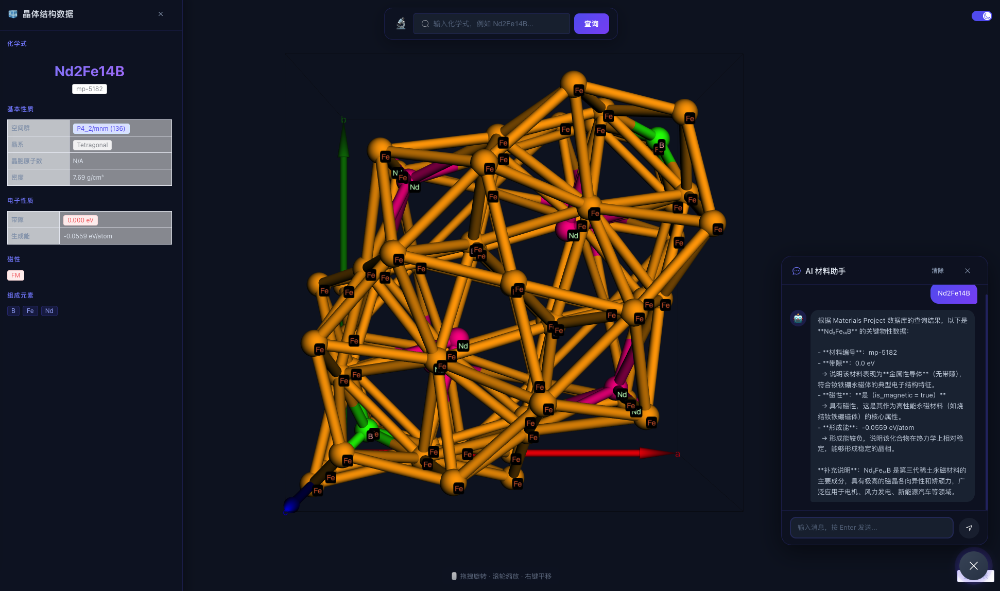

# Material-Copilot

基于 LangChain、FastAPI、MatterGen 和 Materials Project 的材料检索与生成平台。

支持自然语言查询材料、元素替换、MatterGen 候选生成、多模型 Campaign、WebSocket 实时进度和 CIF 3D 可视化。



## 功能

- Materials Project 查询和物性展示
- 自然语言意图识别与 LangChain Agent
- 元素替换和掺杂
- 九种 MatterGen 模型统一路由
- 单模型生成和多模型顺序 Campaign
- WebSocket 实时进度与常驻候选列表
- 3Dmol.js 晶体结构可视化

技术栈：Vue 3、TypeScript、Vite、Element Plus、FastAPI、LangChain、PyTorch、MatterGen、MatterSim、3Dmol.js。

## 快速开始

### 1. 配置

```bash
cd backend
cp .env.example .env
```

至少填写：

```bash
LLM_API_KEY=...
LLM_BASE_URL=https://api.deepseek.com
LLM_MODEL=deepseek-chat
MP_API_KEY=...
```

### 2. 安装后端

```bash
cd backend
uv sync
```

该命令会创建 `backend/.venv`，并安装后端、MatterGen、PyTorch、PyG、MatterSim 和 LangChain。

不要跨操作系统复制 `.venv`。每台机器需要重新执行 `uv sync`。

### 3. 下载模型权重

权重不会通过 Git 同步，每台机器需要单独下载。最小可用权重：

```bash
export HF_ENDPOINT=https://hf-mirror.com

hf download microsoft/mattergen \
  checkpoints/dft_mag_density/checkpoints/last.ckpt \
  --local-dir backend/vendor/mattergen
```

其他模型的下载地址可通过 `GET /api/generation/models` 查询。

权重必须放在：

```text
backend/vendor/mattergen/checkpoints/<model_id>/checkpoints/last.ckpt
```

### 4. 启动后端

```bash
cd backend
.venv/bin/python -m uvicorn main:app \
  --reload \
  --host 0.0.0.0 \
  --port 8000
```

API 文档：`http://127.0.0.1:8000/docs`

### 5. 启动前端

```bash
cd frontend
npm install
npm run dev
```

访问 `http://localhost:5173`。

## MatterGen 模型

| 模型 ID | 条件 | 用途 |
|---|---|---|
| `mattergen_base` | 无 | 通用材料探索 |
| `mp_20_base` | 无 | MP-20 通用生成 |
| `dft_mag_density` | `dft_mag_density` | 高磁密度候选 |
| `dft_mag_density_hhi_score` | `dft_mag_density`、`hhi_score` | 磁性能与供应风险 |
| `chemical_system` | `chemical_system` | 指定元素体系 |
| `chemical_system_energy_above_hull` | `chemical_system`、`energy_above_hull` | 元素体系与稳定性 |
| `dft_band_gap` | `dft_band_gap` | 指定带隙 |
| `ml_bulk_modulus` | `ml_bulk_modulus` | 体积模量 |
| `space_group` | `space_group` | 指定空间群 |

权重缺失时接口返回 `MODEL_WEIGHTS_NOT_FOUND`，并给出预期路径和下载地址，不会静默切换模型。

## 使用示例

```text
查看 Nd2Fe14B 的晶体结构
把 Nd2Fe14B 中的 Fe 替换成 Co
帮我设计两个高磁密度磁性材料候选
生成高磁密度且低供应风险的磁性材料
设计 Nd-Fe-B 体系中的稳定材料
生成带隙约 1.5 eV 的材料
生成空间群为 194 的晶体结构
使用所有模型全面探索新型磁性材料
```

## 主要接口

```text
POST /api/chat
GET  /api/material/search

POST /api/generation/jobs
GET  /api/generation/jobs/{job_id}
GET  /api/generation/jobs/{job_id}/candidates
POST /api/generation/jobs/{job_id}/cancel

POST /api/generation/campaigns
GET  /api/generation/campaigns/{campaign_id}
GET  /api/generation/campaigns/{campaign_id}/candidates
POST /api/generation/campaigns/{campaign_id}/cancel

GET  /api/generation/models
WS   /api/ws
```

## 项目结构

```text
material-sandbox/
├── backend/
│   ├── agent.py
│   ├── intent/              # 语义意图路由
│   ├── skills/              # LangChain Tools
│   ├── generation/          # 模型注册、任务、Worker、Campaign
│   ├── realtime/            # WebSocket 网关
│   ├── vendor/mattergen/    # MatterGen 源码、配置和权重
│   └── tests/
├── frontend/
└── doc/
```

## 测试

```bash
cd backend
.venv/bin/python -m pytest

cd ../frontend
npm run build
```

更多实现细节见 [后端文档](doc/backend.md)、[元素替换文档](doc/element_substitution.md) 和 [MatterGen 集成方案](doc/mattergen-integration-refactor-plan.md)。

## 许可证

MIT License
